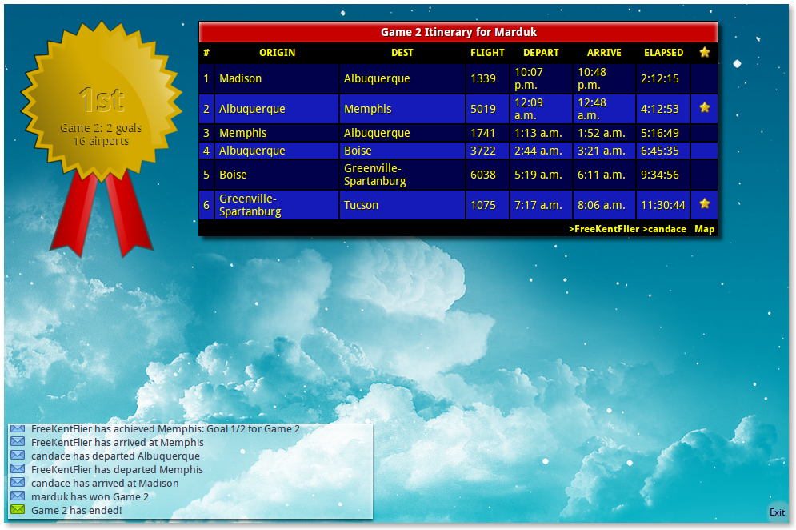

# Airport

Airport is a multi-player game of skill, memory & chance where each player
starts at the same airport in a race to goal cities. The player who reaches the
final goal first wins the game.

Tools used: Python, Django, Tornado, JQuery.

## Screenshots

### Login

### Game Screen

### Game Play

### Game Paused

### In Flight

### Game Finished ###

### Game Summary

### Summary with Map

